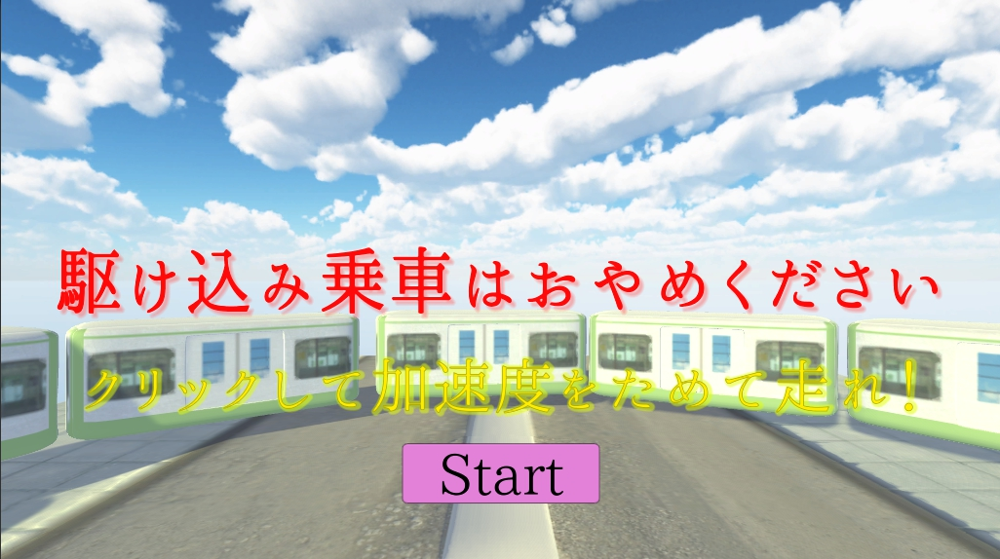

# nolastminuteride
 - [駆け込み乗車はおやめください](https://hhdfgg.github.io/nolastminuteride/WebGL/)
 

# unityroomの１週間ゲームジャム「ぎりぎり」

- unityroomURL[駆け込み乗車はおやめください](https://unityroom.com/games/nolastminuteride)
 
# 説明
 - 10秒間クリックして加速度をためて走れ
 - 間に合えばクリアですが、<b>駆け込み乗車は危険ですのでおやめください。</b>
 - 判定はシビアです。
 - unityroom上では、画面外をクリックしたら停止するようになっています。疲れたら休憩してくださいね！

 ## 使用アセット
   - [ファイティングユニティちゃん　無料お試しアセット](https://assetstore.unity.com/packages/3d/animations/hq-fighting-animation-free-33478)
   - [Bodyguards](https://assetstore.unity.com/packages/3d/characters/humanoids/bodyguards-31711)
   - [Free HDR Sky](https://assetstore.unity.com/packages/2d/textures-materials/sky/free-hdr-sky-61217)
   - [TextMesh Pro](https://assetstore.unity.com/packages/essentials/beta-projects/textmesh-pro-84126)
   
   - [なるべく簡単にオンラインランキング機能をつけるサンプル（無料）](http://blog.naichilab.com/entry/webgl-simple-ranking)

## フリー素材
  - [魔王魂](https://maoudamashii.jokersounds.com/)
  - [効果音ラボ](https://soundeffect-lab.info/)
  - [DOVA-SYNDROME](https://dova-s.jp/)
  - [ほのか明朝](http://font.gloomy.jp/honoka-mincho-dl.html)

# 一週間の流れ

## 月曜日
 - 何も案が思いつかなかったので何も作業なし
 
## 火曜日
 - 案が思いついた。
 - スマホに取ったメモ
  - 「駆け込み乗車やめましょう」というコンセプト
  - クリックかボタン連打でパワー（加速度）をためて、一気にプレイヤーを走らせる
  - そして、扉が閉まる前に乗車出来たらクリアだが、「駆け込み乗車は危険ですのでおやめください！」とテキスト表示しランキングにいく。
  - 扉が閉まったらゲームオーバーで、こっちは「とても危険ですのでおやめください！」とテキスト表示しランキングにいく
  - ランキングはクリック数
 ### 作業開始
 - 扉の動きとプレイヤーが１０秒間クリック出来るように動きを付けた。
 - 火曜日終了
 
## 水曜日
 - クリック数と発車までの時間を、テキスト表示。
 - タイトルとクリアとゲームオーバーのシーンをつくり、つなげる
 - MAYAで電車のモデル作り（途中）
 
## 木曜日
- MAYAでの電車のモデル作り（完成）
- プレイヤーを人型のAssetに変更([Bodyguards](https://assetstore.unity.com/packages/3d/characters/humanoids/bodyguards-31711))
- アニメーションをつける
- [ファイティングユニティちゃん　無料お試しアセット](https://assetstore.unity.com/packages/3d/animations/hq-fighting-animation-free-33478)から"Run"と"Damage"をつける
 - アニメーションをつけるときに参考になったサイト[【Unity】3Dモデルのアニメーションを別の3Dモデルで使い回したい](http://ghoul-life.hatenablog.com/entry/2017/07/11/210324)
 
## 金曜日
 - 主に調整や修正
 - プレイヤーの動きとカメラの調整と、扉の閉まるスピードの調整
 - クリック数と発車までの時間を初期化で0にし忘れていたので修正

## 土曜日
 - WebGLでビルドし、最終調整
 - テキストのずれや、オブジェクトのずれがないように調整
 - unityroomに投稿

## 日曜日
 - unityroomの基本情報やスクリーンショット、使用アセットを追加
 
 
# 今回の反省
 - コメントにより電車をすり抜けることが判明しました。これは単純なミスでプレイヤーの方のRigidbodyのCollision Detectionを変更していなかったのが原因でした。
 - 反省といたしましては、デバックを全然やっていなかった点がかなり大きかったと思います。動きや判定だけデバックを終わらせてしまい、通しでデバックを行ったのは数回程度だったかと..
 - <b>デバックはとても重要!</b>

---

- あと、途中経過などのスクリーンショットやGIFなどを残しておいたりすると良いと思いました。

# ニフクラのNCMBを利用したAndroidビルドの注意
 - [なるべく簡単にオンラインランキング機能をつけるサンプル（無料）](http://blog.naichilab.com/entry/webgl-simple-ranking)を使用したAndroidビルドの注意点 
 - Unity 2018.1.0f2
 
- エラー内容
  - 端末の方でインストールできず「パッケージの解析中に問題が発生しました」が出てきた。

- 検索
  - 「unity android パッケージの解析中に問題が発生しました」で検索
  - ヒット
  - [UnityでNCMB使用時にAndroidビルドするとインストール出来ない問題](http://saitetutan.hatenablog.jp/entry/2016/09/16/230116)
  
- 対処
 - [UnityでNCMB使用時にAndroidビルドするとインストール出来ない問題](http://saitetutan.hatenablog.jp/entry/2016/09/16/230116)を参考にして、 "<b>Plugins</b>フォルダの<b>Android</b>フォルダにある<b>AndroidManifest.xml</b>をVisual Studioで開く" "<b>AndroidManifest.xml</b>"の中の"YOUR PACKAGE NAME"を"Player Settings"の"Pakage Name"と同じにする。だいたい3～4個ほどある。 ※"Player Settings"の"Pakage Name"はデフォルトの名前ではビルドの時にエラーが出るので、"com.自分のCompany Name.自分のProduct Name"に変更してください。"Company Name"と"Product Name"は"Player Settings"の一番上にあると思います。
- これで、端末にインストールできると思います。
